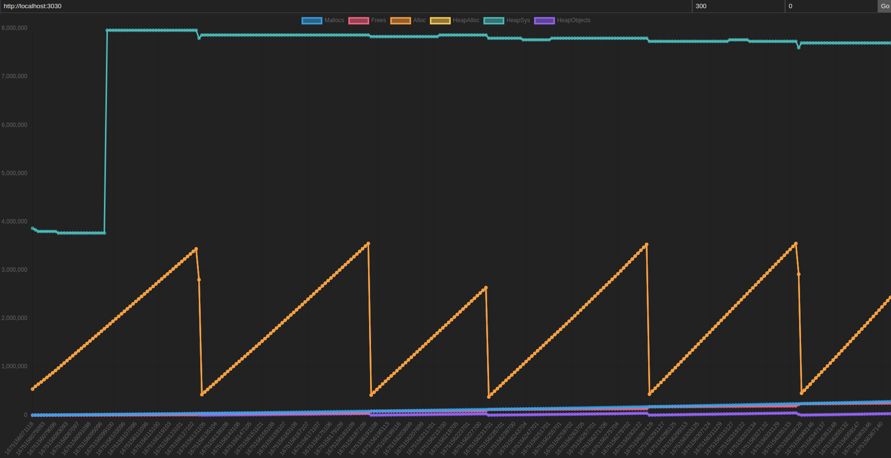

# README

In this repository, we experiment with creating and checking memory leaks in cgo.

We try to be precise with each of our experiments and play with various known approaches.
We write some scripts/tools along the way to help make sense of things.

Please include for future reference all relevant notes/thoughts in this repo for my future reference.
If we clean this up, we might put it up on Github.

PS: Let 'we' = 'I' -- this is just how I talk to myself when working through a problem.

## Problem

How can we clearly and definitively identify that a cgo program is leaking memory? 

Let's explore this problem space.

## Solution (TLDR)

- Use [JeMalloc](https://github.com/jemalloc/jemalloc/wiki/Getting-Started) or [AddressSanitizer](https://clang.llvm.org/docs/AddressSanitizer.html) -- Make sure that you call C.exit(...) at the end to trigger
  the leak summary. See Notes for below for details.

## Write-Up / Notes

### Using Valgrind

* See the following Golang Issue: [Golang-Issue-782](https://github.com/golang/go/issues/782)

We see from the above discussion that Valgrind is NOT expected to work for cgo programs at all.  

This is confirmed from the Heap Summary reports of the `cgo-leak-001` and `cgo-good-001` 
-- both of these appear to have leaked memory according to Valgrind, which is incorrect.

Valgrind is of no more use here!


Here is the leak summary for `cgo-good-001` which calls `free` right after `malloc`, so
no memory leak is expected. 
```
==37267== HEAP SUMMARY:
==37267==     in use at exit: 1,488 bytes in 7 blocks
==37267==   total heap usage: 12 allocs, 5 frees, 2,640 bytes allocated
==37267==
==37267== LEAK SUMMARY:
==37267==    definitely lost: 0 bytes in 0 blocks
==37267==    indirectly lost: 0 bytes in 0 blocks
==37267==      possibly lost: 1,440 bytes in 5 blocks
==37267==    still reachable: 48 bytes in 2 blocks
==37267==         suppressed: 0 bytes in 0 blocks
```

Here is the leak summary for `cgo-leak-001` which does NOT call `free` after `malloc`. 
```
==36459== HEAP SUMMARY:
==36459==     in use at exit: 1,176 bytes in 5 blocks
==36459==   total heap usage: 10 allocs, 5 frees, 2,328 bytes allocated
==36459==
==36459== LEAK SUMMARY:
==36459==    definitely lost: 0 bytes in 0 blocks
==36459==    indirectly lost: 0 bytes in 0 blocks
==36459==      possibly lost: 1,152 bytes in 4 blocks
==36459==    still reachable: 24 bytes in 1 blocks
==36459==         suppressed: 0 bytes in 0 blocks
```

Not very helpful, not helpful at all.

Furthermore, it seems that any cgo program run through Valgrind shows left over
memory on the heap at exit.

Here are the results for `cgo-noop-001`, a no-op cgo program which does nothing but call
a void function in C. 
```
==37892== HEAP SUMMARY:
==37892==     in use at exit: 1,176 bytes in 5 blocks
==37892==   total heap usage: 9 allocs, 4 frees, 1,304 bytes allocated
==37892==
==37892== LEAK SUMMARY:
==37892==    definitely lost: 0 bytes in 0 blocks
==37892==    indirectly lost: 0 bytes in 0 blocks
==37892==      possibly lost: 1,152 bytes in 4 blocks
==37892==    still reachable: 24 bytes in 1 blocks
==37892==         suppressed: 0 bytes in 0 blocks
==37892== Rerun with --leak-check=full to see details of leaked memory
```

The question is then, if not Valgrind then what? and how?

### Using eBPF Tools

* [Hunting With eBPF](https://zendesk.engineering/hunting-down-a-c-memory-leak-in-a-go-program-2d08b24b617d)

This eBPF approach, installing `bpfcc-tools` somehow borked my machine, so we'll get back to this a bit later. 

This also feels like a big hammer for what is essentially a simple problem.
Let's revisit this after other simpler options are exhausted. 

All we want to do at the moment is cause a leak and confirm with tooling that there was a leak.
That's the only goal, simple. We're not black box testing some giant library, at least not yet,
baby steps first. 

### Using Go Pprof

* [Using Go pprof](https://pkg.go.dev/runtime/pprof)

This looks promising, part of Go, highly recommended, gives us memory metrics which is what we want. 
Let's run with it, if we have a long-running program leaking memory, we should see allocation growth. 

Let's write a simple tool to hit a leaky endpoint over HTTP, collect/parse
metrics from the Pprof endpoint, and then graph it. 
There's probably some giant tool that can do all of this already, but I don't have time to
learn it. I think I see how this could work.

Ok, so I wrote two simple HTTP pprof programs and a small JS tool for graphing/plotting the results. 
The tool is located in the folder `heap-watcher`. 
It is a simple JS SPA that will hit a /x/leak1 endpoint and also grab metrics from /debug/pprof/heap. 

To use it, run one of the following programs first:
* cgo-http-pprof-001 -- The /x/leak1 endpoint is actually leaky.
* cgo-http-pprof-002 -- The /x/leak1 endpoint is NOT leaky, it calls a no-op function.

Then, open up `./heap-watcher/index.html` in your browser.

Fill in the base URL on top of the page to the root URL of the program you selected, and hit the 'Start' button to start hitting
the leaky endpoint and collecting metrics at the same time. 

There is also a timer feature if you want to collect say '300' seconds of metrics.
The UI isn't great, but it's the second input field on top that by default contains '0'. A countdown value of 0 means it will run forever.

Run it for some time and see if there is obvious unchecked allocation
growth.

Result: both leaky and non-leaky programs have nearly identical graphs,
the usual sawtooth pattern of allocation, with cleanup happening
during the GC pause.

This entire approach seems like it might be useless for cgo because Go pprof does not monitor allocations in cgo, it only monitors the Go side of memory allocations. 

### Using JeMalloc

* [JeMalloc](https://github.com/jemalloc/jemalloc/wiki/Getting-Started)
* [DGraph-Approach](https://dgraph.io/blog/post/manual-memory-management-golang-jemalloc/)

This seems like a good approach. It's simple and we can see how/why it would work. 

- replace malloc with one that keeps stats like jemalloc.
- print the stats.
- if there is unfreed memory at the end, assume the implementation has a leak. 

This doesn't require generating or looking at graphs of memory use, it's much more straightforward.

This seems nice because we can ideally, use it for leak testing any cgo program. 

For this approach we have ./sub/jemalloc as a Git submodule, which you must first
build. Build with:
```
./autogen.sh
./configure --enable-prof
make
```

Just skip `make install`, so that we can keep it all in one directory to update versions or whatever as needed.

Make sure you run configure with `--enable-prof` which enables the profiling functionality that we require for 
leak testing.

Let's first see if it works in C
```
./scripts/with-jemalloc-1.sh ./build/c-leak-001
```
It does, it detects the leak:
```
calling malloc() ...
<jemalloc>: Leak approximation summary: ~83968 bytes, ~3 objects, >= 3 contexts
<jemalloc>: Run jeprof on dump output for leak detail
```

Let's see if it works for a simple cgo program. 

```
./scripts/with-jemalloc-1.sh ./build/cgo-leak-001
```

```
calling malloc() ...
```

Nope, not seeing the summary print out at the of this program as we did with the simple C program.

It looks like the `je_malloc` exit hooks are not being called. Let's take a closer look at how the engineers over at DGraph do it.
Well it looks like they are manually calling `je_malloc` instead of replacing `malloc`, so this doesn't apply to us.

I think what is happening here is the C exit function is not called, which is registered by jemalloc using
atexit. See the following open issue with Golang
[Golang-Issue-20713](https://github.com/golang/go/issues/20713).

We can try to call the libc exit function manually.
This seems to do it, jemalloc now prints the leak summary, see the following files
for the jemalloc modified versions:
* `cgo-leak-001-j1.go`
* `cgo-good-002-j1.go`

Both are modified to manually call `C.exit(0)` at the end of `main`, which seems to trigger the `atexit` handlers that we want.

Now there's a bigger problem, it looks jemalloc for both plain-C and cgo, is printing a leak summary indicating leaks for *both*
the expected leaky program *and* the baseline programs. 

To show you what I mean, let's run with jemalloc the `c-baseline-001` program. 

```
./scripts/with-jemalloc-1.sh ./build/c-baseline-001
```

```
<jemalloc>: Leak approximation summary: ~82944 bytes, ~2 objects, >= 2 contexts
<jemalloc>: Run jeprof on dump output for leak detail
```

Ok, strange, we have basically a hello-world program that is according to jemalloc leak profiler, leaking
memory. We need a clean signal to compare our leaky signal against, and we're not getting it, even in this
simple C hello-world baseline program. 

Comparing this against our known leaky C program `c-leak-001`, we get the following output.

```
./scripts/with-jemalloc-1.sh ./build/c-leak-001
```

```
[output trimmed]
<jemalloc>: Leak approximation summary: ~83968 bytes, ~3 objects, >= 3 contexts
<jemalloc>: Run jeprof on dump output for leak detail
```

So the difference is ~3 objects in the leaky program vs ~2 objects in the clean program. 
Let's see if we can make this signal stronger by leaking more. 

Ok, we have a new modified version that leaks many times in file `c-leak-002.c`, in running
this version, we see a good strong signal. 

```
[output trimmed]
....................................................................................................
<jemalloc>: Leak approximation summary: ~84544 bytes, ~102 objects, >= 3 contexts
<jemalloc>: Run jeprof on dump output for leak detail
```

100 extra allocations on top of the baseline 2 allocations, one for each malloc call.

Let's now run this with some frees, to see how jemalloc treats a program with more allocations *and* deallocations,
more calls to malloc paired with calls to free.

Take a look at `c-good-002.c`, here we have a program with calls to free right after malloc,
and we see an output that looks a lot like that of c-baseline-001.

```
[output trimmed]
....................................................................................................
<jemalloc>: Leak approximation summary: ~82944 bytes, ~2 objects, >= 2 contexts
<jemalloc>: Run jeprof on dump output for leak detail
```

So far so good, at least in C land. Let's see if we can replicate these results in cgo.

Okay great, we have the same result in cgo, see the following files to run `./script/with-jemalloc-1` against:
* `cgo-leak-002-j1`
* `cgo-good-002-j1`

At last I think we have a way to test for cgo memory leaks, which is also how one would test memory leaks in
general for dynamically linked libc programs.

We should now be able to apply this to non-toy programs/libraries.

One caveat: notice that our cgo programs print out pointer address to stdout, this counts as doing something with the pointer, without this it seems like the malloc call gets optimized away. So keep this in mind for your own tests in whatever critical section of code you might be testing.

## Using AddressSanitizer

See: [](https://clang.llvm.org/docs/AddressSanitizer.html#memory-leak-detection)

This works rather beautifully. Much like the jemalloc approach, to get this to work in cgo, 
we just have to make sure that C.exit(0) is called upon exit, so that the atexit registered handlers 
get called. One of these handlers is the asan leak report that we want to see.

```
 ./scripts/with-asan-1.sh cgo-leak-001-j1.go
```

```

calling malloc() ...

=================================================================
==435603==ERROR: LeakSanitizer: detected memory leaks

Direct leak of 1000 byte(s) in 1 object(s) allocated from:
    #0 0x4a028e in __interceptor_malloc (/tmp/go-build3472842202/b001/exe/cgo-leak-001-j1+0x4a028e) (BuildId: 1cdf702ee1633107c6de1e3787069adb078f9c55)
    #1 0x53396b in hello (/tmp/go-build3472842202/b001/exe/cgo-leak-001-j1+0x53396b) (BuildId: 1cdf702ee1633107c6de1e3787069adb078f9c55)
    #2 0x5339a8 in _cgo_d8842234e16f_Cfunc_hello (/tmp/go-build3472842202/b001/exe/cgo-leak-001-j1+0x5339a8) (BuildId: 1cdf702ee1633107c6de1e3787069adb078f9c55)
    #3 0x52f4e3  (/tmp/go-build3472842202/b001/exe/cgo-leak-001-j1+0x52f4e3) (BuildId: 1cdf702ee1633107c6de1e3787069adb078f9c55)

SUMMARY: AddressSanitizer: 1000 byte(s) leaked in 1 allocation(s).
exit status 1
```

The output is nicer and clearer than that of jemalloc. 
Let's see how it looks without a memory leak.

```
./scripts/with-asan-1.sh cgo-good-001-j1.go 
```

```
calling malloc() ...
calling free() ...
```

No ASAN error printed. 

## Tools / Scripts

### Heap-Watcher

This could potentially be used in the future for leak testing
long running processes. The sample HTTP server programs in this repo
will serve as a reminder to me, on how to use it.

Heap-watcher repeatedly hits the /x/leak1 endpoint, which 
users can substitute with whatever long-running gocode they suspect
is leaky.

We might take this and break it out into its own repo. If so, I will update this section here.



TODO:

* Make the parsed-fields user-selectable.
* Improve Timer/Countdown UI.
* Different graphs for different metrics with synchronized time.
* Different graphs for different programs with synchronized time.

### ./scripts/with-jemalloc-1

This repo has jemalloc as a submodule, and this script serves
as a reminder to my future self on how to use jemalloc without having
to read through various other sources.

There are a few things I like about this.

It is referencing the jemalloc submodule in this repo, not some system jemalloc, this will allow us to switch to different versions of jemalloc if needed.

It's numbered like the other scripts, therefore if I need another common set
of profile options, I can just copy it to make another one. 
This seems like a little thing, but I like having it set up this way because then I'm not relying on my command-line history.

## ./scripts/with-valgrind-1

Calls valgrind with some options set, just like jemalloc. 
It should serve as a good reference for these options should I need them again.
